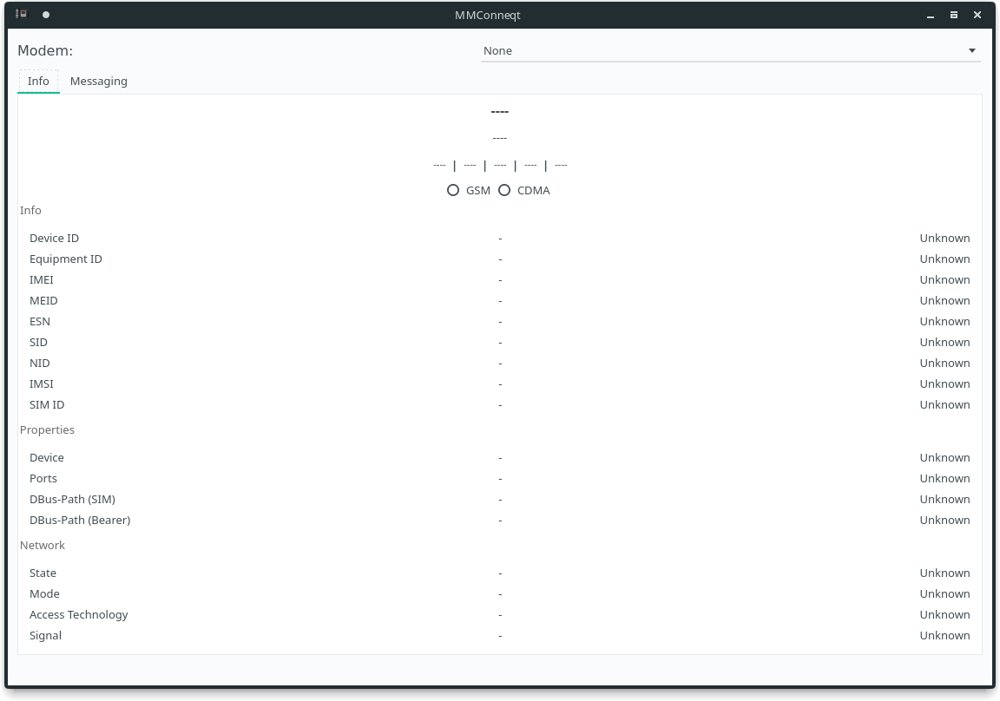

<!-- @format -->

# MMConneqt

## Description

A qt based gui for Modem Manager.




### Features

- Modem Viewer
  - View Modem information (Device, Name, Manufacturer, IMEI, IMSI, etc..)
- Message Viewer
  - Browse SMSs
  - Save, Send or Resend SMSs
  - Delete SMSs in bulk or singly
  - Block certain numbers by setting AutoDeletes

## Dependencies

- Qt
- qmake (For compiling)

## Build

Compile

---

```sh
git clone https://gitlab.com/Antiquete/mmconneqt
cd mmconneqt
mkdir build && cd build
qmake ../MMConneqt.pro
make
```

Run

---

```sh
./MMConneqt
```
